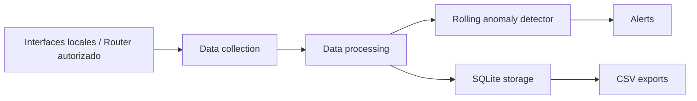

# Arquitectura

## Capas

- `data_collection`: obtiene contadores de interfaces, conexiones activas y metadatos opcionales de paquetes.
- `data_processing`: normaliza metricas como bytes por segundo.
- `data_processing/feature_builder`: convierte conexiones y logs autorizados en features para algoritmos.
- `algorithms`: detecta picos y errores usando una linea base movil.
- `storage`: persiste muestras, conexiones y alertas en SQLite.
- `cli`: comandos operativos para ejecutar el sistema.

## Tablas nuevas

- `flow_features`: dataset principal para modelos de riesgo y comportamiento.
- `dns_events`: dominios consultados desde fuentes autorizadas.
- `http_events_authorized`: eventos web exportados por proxy o aplicacion propia autorizada.
